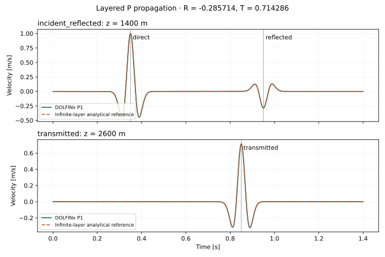

# seisfem

A verified 1D P/S elastic-wave laboratory built with **DOLFINx 0.11**, intended as
the foundation of a future vector seismic FEM solver. It solves separate
longitudinal and transverse reductions of 3D elasticity using CG1 displacement,
aligned DG0 materials, positive lumped mass and explicit central differences.
This release does not implement 2D/3D propagation.

## Install

FEniCSx/PETSc/MPI are binary dependencies, not a universal pip installation.
A supported conda-forge environment is defined in `environment.yml`:

```bash
conda env create -f environment.yml
conda activate seisfem
python -m pip install -e '.[cli,dev]'
seisfem info
```

For the exact tested Linux environment, including headless plotting for the
validation figure:

```bash
conda create -n seisfem-locked --file environments/linux-64.explicit.txt
conda activate seisfem-locked
python -m pip install -r environments/pip-lock.txt
python -m pip install -e '.[cli,dev]'
```

The explicit lock includes binary build URLs/checksums and is architecture-specific;
it is not a portable cluster lock. See [installation notes](docs/user_guide/installation.md).
Qt is absent from the headless lock and backend dependencies. `gui`, `notebook`
and `viz` extras are optional dependency groups; no GUI is implemented.

## Run the same experiment from either frontend

```bash
seisfem validate examples/1d/layered.yaml
seisfem run examples/1d/layered.yaml
python examples/1d/analyze_layered.py
```

```python
from seisfem import Simulation, SimulationConfig

config = SimulationConfig.from_yaml("examples/1d/layered.yaml")
result = Simulation(config).run()
# Optional xarray: result.to_xarray()
```

Output directories must be new. Use a different `output.directory` for another
run, or `null` for in-memory results with `snapshot_stride: 0`. Relative paths
are relative to the launch working directory. There is no numerical logic in
the CLI. Other commands: `inspect MODEL`, `mesh MODEL DESTINATION.xdmf`, and `info`.

```bash
mpiexec -n 4 seisfem run model-with-new-output-directory.yaml
```

All ranks call the same API with identical configuration. Each result contains
**locally owned receivers**, ordered by `receiver_ids`; serial is MPI size 1.
Trace axes are `(time, receiver, component)` and units are m, m/s, m/s². NPZ shards
need no pickle; metadata names every shard. Distributed XDMF/HDF5 stores materials
and strided displacement snapshots. Receiver histories remain in memory until
completion; this is a documented scale limit.

## Scientific contract

* Positive-up z in metres, SI throughout; no implicit depth conversion.
* P uses lambda+2mu, S uses mu; neither is an acoustic pressure substitution.
* Materials accept density/vp/vs or density/lambda/mu, with positive solid bulk
  and shear moduli. Every layer interface must be a mesh vertex.
* Degree is explicit but only 1 is verified. Unsupported settings fail validation.
* A point-force amplitude is signed **Pa** in this planar 1D reduction, not N.
* Free means zero traction; fixed means zero displacement. Endpoint impedance
  is a tested 1D absorber, not a multidimensional PML.
* Stability is bounded for the actual discretization; wavelength warnings do
  not certify accuracy. S waves often require finer meshes than P waves.

[Theory](docs/theory/navier_cauchy.md) · [Architecture](docs/architecture/overview.md) ·
[Time integration](docs/numerics/time_integration.md) ·
[Mass lumping](docs/numerics/mass_lumping.md) ·
[API audit](docs/architecture/dolfinx_011_api.md) ·
[Measured verification](docs/validation/results.md) ·
[Critical review and 2D gates](docs/validation/scientific_review.md)

The [independent adversarial audit](docs/validation/adversarial_audit.md) records
the baseline, claim-to-evidence matrix, additional counterexamples, demonstrated
validation correction, and limits of the 1D trust assessment.



## Develop and verify

```bash
python -m pytest -q
ruff check src tests examples
ruff format --check src tests examples
pre-commit install
```

The suite launches its own two-/four-rank MPI subprocesses. Run pytest once,
not under mpiexec. For batch environments disallowing nested MPI jobs, run
`pytest -m 'not mpi'` locally and schedule the MPI tests separately. Source and
receiver physics, interface amplitudes, convergence and discrete energy have
analytical tests; regression snapshots are not the basis of acceptance.

The license and citation authors remain explicit placeholders pending the
copyright holder's decision. No authorship, institution or license was invented.
