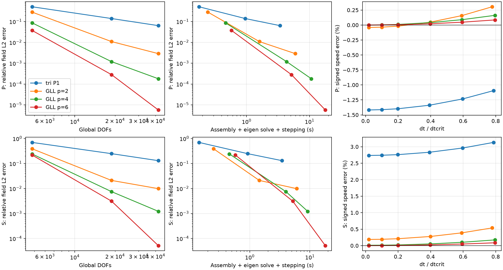

# 2D quadrilateral GLL spectral elements

This report validates **homogeneous isotropic plane strain on structured,
affine rectangular quadrilaterals with free boundaries**. Continuous GLL orders
1–6 are supported; propagation and cost studies cover p=2,4,6. The triangular
P1 backend remains the default, with its existing numerical assembly and
time integrator preserved. The base is main/v0.7.1, commit
`b4df73b58463415971093af84c01addd0cdb3f6d`, which includes VTI interface validation.

**Implementation update:** the SEM mesh now uses an explicit tensor-product Q1
coordinate element, and its mass/stiffness forms use FFCx sum factorization.
The correction and equivalence measurements are documented below. The original
research tables, plots and timing JSON remain the historical results from
`5023ae3`; they are not new performance measurements of factorized evaluation.

The evidence supports substantially better wave accuracy per DOF in this
smooth homogeneous regime. It does **not** establish universal speed superiority
or a universal optimal order. Higher order increases stencil density and usually
reduces the explicit timestep. Fixed-accuracy comparisons below include these
costs and show which targets were actually attained.

The subsequent [heterogeneous SEM milestone](2d_gll_sem_heterogeneous.md) adds
element-aligned horizontal isotropic layers while retaining this homogeneous
path and its validation.

## Equations, elements, quadrature

Coordinates are (x,z), with positive-up z and SI units. The equation is
rho u_tt - div(sigma)=f, with epsilon=sym(grad u) and
sigma=lambda tr(epsilon)I + 2 mu epsilon. The elastic bilinear form is
`a(w,u) = integral [lambda div(w) div(u) + 2 mu epsilon(w):epsilon(u)] dx`.
The exterior natural condition is zero traction; no boundary term or damping
is added. This is vector plane strain, not scalar acoustics.

Installed Basix, DOLFINx and FFCx are **0.11.0**. Actual construction:

```python
scalar = basix.create_tp_element(
    basix.ElementFamily.P,
    basix.CellType.quadrilateral,
    p,
    basix.LagrangeVariant.gll_warped,
)
element = basix.ufl.blocked_element(basix.ufl.wrap_element(scalar), shape=(2,))
dx = ufl.Measure(
    "dx",
    domain=mesh,
    metadata={
        "quadrature_rule": "GLL",
        "quadrature_degree": 2 * p - 1,
    },
)
```

The tensor-product scalar basis has (p+1)^2 nodes. Matching GLL quadrature has
exactly these nodes, with (p+1)^2 positive weights. Because N_i(x_q)=delta_iq,
`M_(i,a),(j,b) = sum_q rho J w_q N_i(x_q) N_j(x_q) delta_ab` is diagonal.
Shared-node contributions add to that diagonal. Each component integrates the
physical mass; summing both vector components gives twice the physical mass.
The production code extracts `M.getDiagonal()` and checks the assembled
off-diagonals. **No SEM row-sum lumping is performed.**

Both M and K use GLL quadrature of degree 2p−1 in each reference coordinate.
This intentional quadrature choice distinguishes this method from ordinary
high-order FEM with Gaussian quadrature. Elasticity includes transverse
polynomial factors that need not be integrated exactly. The independent
NumPy reference uses Legendre-derived GLL roots/weights, independently
differentiated polynomial Lagrange bases, and the engineering-strain matrix
`B^T [[lambda+2mu,lambda,0],[lambda,lambda+2mu,0],[0,0,mu]] B`.
It does not import FEM assembly. Tests compare the complete assembled matrices,
translations, symmetry, and eigenvalue nonnegativity, through p=6.

For p=1 this is **bilinear Q1 with corner GLL quadrature and collocated mass**.
Its stiffness differs from fully integrated Gaussian Q1 (the relative Frobenius
difference exceeds 10% in the independent test). It is not claimed equivalent
to triangular P1. Small negative K eigenvalues are roundoff relative to its
largest eigenvalue, and the translation residuals are normalized by max |Kij|.

## Shared production architecture and API

The small selector is optional:

```python
cfg = SimulationConfig2D.model_validate(
    {
        "domain": {"lower": [-1600, -1600], "upper": [1600, 1600], "cells": [16, 16]},
        "material": {"density": 2200, "vp": 3000, "vs": 1700},
        "discretization": {"type": "quad_gll", "degree": 4},
        "time": {"dt": 0.001, "duration": 0.3},
        "source": {
            "position": [13, -17],
            "direction": [1, 1],
            "wavelet": {"f0": 5, "amplitude": 1e8, "time_shift": 0.08},
        },
        "receivers": [{"name": "off_node", "position": [413, 283]}],
    }
)
result = Simulation2D(cfg).run()
```

`cells` counts elements, not nodal intervals. Omitted `discretization`, or
`{"type":"tri_p1"}`, selects the unchanged triangular path. `quad_gll` defaults
to degree 4 and accepts strict integers 1–6. Element-aligned horizontal isotropic
layers are now supported; see the [heterogeneous validation](2d_gll_sem_heterogeneous.md).
Local elastic [absorbing boundaries](2d_gll_sem_absorbing.md) are now supported.
Other degrees, cut elements, VTI materials, and displacement constraints are rejected.
The executable [example](../../examples/2d/gll_sem.py) prints a (301,1,2)
receiver history and a peak displacement about 5.4804e-4 m.

Only spatial assembly dispatches to `sem2d.py`. PETSc actions, assembled
stability machinery, `CentralDifference`, result handling, and source timing
remain shared. Quadrilateral point functionals use physical-to-reference
pullback and tabulate the same Basix nodal basis. They are not snapped to nodes.
Loads satisfy `f_i(t)=F(t) N_i(x_source) d`; F is the existing point line force
in N/m and d is normalized. There is no source mass/area rescaling. Negative
high-order interpolation weights are legitimate. Exact polynomial receiver
values, total force, virtual work, off-node interpolation, component ordering,
and displacement/velocity histories are tested. The point force generally
excites both modes; pure-mode packets below are test initial fields only.

## Spectral stability and discrete energy

For diagonal D, the exact undamped limit is
`dtcrit = 2/sqrt(lambda_max(D^(-1/2) K D^(-1/2)))`.
The existing SLEPc diagnostic computes this generalized eigenvalue. Small
matrix tests also solve it independently using NumPy. Highest-mode evolution
stays bounded for 120 steps at 0.95 dtcrit and grows strongly at 1.01 dtcrit.
The mesh/degree table reports actual eigenvalue-based timesteps, not a
velocity-CFL heuristic.

Production `start()` retains its existing conservative sufficient bound from
the absolute rows of the mass-scaled stiffness, including its safety factor.
The temporal experiments explicitly instantiate the **same** production
central-difference recurrence with independently eigenvalue-audited timesteps.
Thus a large experimental dt/dtcrit is not a promise that the public
conservative `start()` accepts that fraction. No timestep validator was relaxed.

At integer times, the familiar mechanical diagnostic is
`E_phys=0.5 v_n^T D v_n + 0.5 u_n^T K u_n`. Central differences conserve the
time-consistent half-step quantity

`E_half = 0.5 ((u_(n+1)-u_n)/dt)^T D ((u_(n+1)-u_n)/dt)
          + 0.5 u_(n+1)^T K u_n`.

Equivalently it is `E_phys - dt^2/8 (K u_n)^T D^-1 (K u_n)` for force-free
motion. Tests verify this identity and roundoff drift. Uncorrected integer-time
energy has bounded O(dt^2) oscillations (the JSON records these), which are not
called a violation of the discrete conservation law. Displacement squared is
never used as energy.

## Independent P/SV packet experiment

All methods use rho=2200 kg/m³, Vp=3000 m/s, Vs=1700 m/s, f0=5 Hz,
domain [-2400,2400]^2 m, duration 0.2 s, and the same packet/receiver/reference.
Wavelengths are 600 m and 340 m. Along/transverse Gaussian widths are
sigma_s=360 m and sigma_q=400 m. The initial center is -c T n/2, so the
central packet travels 600 m for P or 340 m for SV, identically across methods.
This is one central period: a short-distance dispersion/accuracy benchmark,
not a long-range seismic modelling performance claim.
Angles are measured from +z toward +x. The main comparison is 25 degrees;
separate tests cover 0,45,-20 degrees.

At t=0, set `Phi=g(s,q) sin(k0 s)/k0`, and `u_P=grad Phi`, or
`u_S=(partial_z Phi,-partial_x Phi)`. The NumPy-only continuum reference
propagates the full two-dimensional spectrum with omega=c|k|. Its smooth
vector spectrum is proportional to k/k0 (or its rotation), rather than a
direction-normalized spectrum singular at k=0. Velocity uses -i omega times
that displacement spectrum. A 128 by 128 spectral grid in a separate 7200 m
period gives the continuum field; a 160-grid audit and the closed-form initial
potential agree to roundoff. The packet is approximately monochromatic, not
an exact single-angle plane wave. The Gaussian-envelope estimate of RMS energy
angular bandwidth is about 9.7 degrees for P and 5.5 degrees for SV; the full
continuum spectrum, including diffraction, is used as truth.

Diagnostics use these same definitions for P1 and SEM:

* Phase: mass-weighted spatial Fourier coefficient at the nominal k0,
  projected onto the analytical polarization, tracked from 0 to T. Subtract
  the continuum coefficient's finite-window/quadrature phase bias evaluated
  with the identical functional. Relative phase-speed error is minus that
  residual divided by omega0 T. Raw and continuum phases remain in JSON.
* Field L2: final vector field interpolated onto a common 97 by 97 uniform
  physical grid, compared directly with the continuum field. This is a
  **sampled** relative L2 norm, not an exact integral norm.
* Waveform L2: the full projected displacement history at the fixed off-node
  receiver (43.7,-27.1) m versus its independent continuum history.
* Arrival: the positive crest time, with local parabolic interpolation, versus
  the continuum crest. It is a waveform arrival diagnostic, not a new speed
  estimator or a raw envelope group-direction claim.
* Polarization: transverse/parallel central Fourier coefficient magnitude.
* Phase-normal direction: weighted spectral centroid in the outgoing
  hemisphere and broad 0.5–1.5 k0 annulus, compared with the identical
  continuum diagnostic. No predicted narrow angular search mask is used.

Moving the free boundaries to ±3000 m, preserving element h=200 m, packet,
duration, and analysis window, bounds their diagnostic influence in the table.
This is stronger than assuming isolation from a picture. The finite Gaussian
tails are not literally compactly supported. Phase-normal directions and
isotropic wavefront propagation are checked; a separate packet-centroid
measurement is not claimed.

The spatial study uses effective nodal counts n=48,96,144 per axis, hence
2(n+1)^2 global vector DOFs for every method. SEM has (n/p)^2 elements,
triangles 2n². Reported points per wavelength use the average nodal interval
4800/n; GLL interior spacings are nonuniform. For triangles, the tabulated h
is the parent rectangular-grid spacing (the longest triangle edge is sqrt(2)h).
Angular acceptance uses n=192
for p=2 and n=144 for p=4/6. The initial quadratic axial SV result at n=144
had 1.532% field error against the new 1.5% angular-test target; its grid was
refined without altering the target or equal-DOF comparison.
The fixed-element-count order study deliberately starts very coarse. Its
p=2 SV case has only 1.7 average points per wavelength and field error above
100%; its central coefficient is aliased and is not a reliable phase-speed
measurement. The table labels that entry unresolved (the raw proxy remains
in JSON). Resolved propagation claims use the finer grids, not that entry.

## Accuracy versus time and work

The baseline spatial study uses dt/dtcrit approximately 0.02. This suppresses
temporal error but does not eliminate it; the smallest high-order phase
residuals can already be time-limited. Temporal sweeps at n=96 use requested
fractions 0.02,0.1,0.2,0.4,0.6,0.8; dt is adjusted down to reach T exactly.
The signed error table demonstrates cancellation: for p=2 P, spatial lag
crosses through zero as temporal phase advance increases. The P1 lag decreases
over the tested interval without crossing zero for P. No cancellation point
is called spatial convergence. Separate eigenmode tests converge to the exact
semidiscrete solution at temporal order two, using 40,80,160,320 steps.

Fixed-accuracy comparisons search only the **measured candidate set**: the
main grids/fractions plus triangular n=192,288,384 at fraction 0.1. They require
both P and SV to satisfy the stated field or waveform target. The fastest
observed eligible pair is reported with its actual fraction. Selection can
benefit from dispersion cancellation; the small-dt spatial table is therefore
essential context. “Not attained” means not attained on these tested grids,
not impossible for the method. No cost interpolation/extrapolation is used.
An additional waveform table restricts candidates to `dt <= 0.9*safe_dt`,
the default public `start()` rule. This excludes the SEM fraction-0.8 choices
and makes the distinction between the eigenvalue experiment and the default
public workflow explicit. Packet initial fields still enter through the shared
low-level integrator, since the source-driven experiment API starts from rest.

Timing includes assembly, the actual SLEPc eigen solve, and stepping with
receiver/energy diagnostics; continuum synthesis, point-map setup, and report
generation are excluded. It is a measured backend timing, not end-to-end user
latency. Assembly times use a warm FFCx cache. These are single observations
on a shared workstation with one BLAS/OpenMP thread, so small timing differences
are not significant (Intel Core i7-10700K, eight physical cores). Pair times
sum the separately executed P and SV runs.
The hardware-independent DOFs × steps proxy does not count the denser SEM
stencils or setup, and must not be equated with real work. PETSc's memory
counter returned zero in this build; memory measurements are unavailable,
rather than evidence of zero memory use.

For the tested short-window waveform target and default public timestep bound,
the fastest eligible 1% pair is p=4 at 18,818 DOFs/run: 0.764 s, versus
44.268 s for the tested triangular P1 pair at 296,450 DOFs/run. For 0.1%,
p=6 at 18,818 DOFs/run takes 1.738 s; p=4 reaches that target at 42,050 DOFs/run
in 19.901 s. These observations favor p=4 for the looser target and p=6 for
the tighter one in this candidate set. They are not general speedup factors:
the target, timestep fractions, short propagation distance, setup definition,
warm cache and single-run timing conditions all matter.

## MPI, compatibility, and reproducibility

The p=4, n=96 oblique P packet and a separate public point-force experiment
run on 1,2,4 ranks. Owned arrays are gathered and sorted by rounded physical
coordinates, never local numbering. Tests compare mass, stiffness action,
final u/v, dtcrit, receiver u/v, field errors, spectral angle, and exact source
virtual work. Relative tolerances for cancellation-sensitive actions use the
maximum physical-field scale. The detailed differences appear below.

Default and explicit triangular selectors give bitwise-identical M, K, mass
and timestep in a direct test. A separate archived-main comparison runs
`tests/sem2d/compatibility.py` with each checkout's `src` on `PYTHONPATH`.
All eight snapshots (M, K, mass, stable dt, stiffness action, source vector,
displacement history, velocity history) are **bitwise identical**, with zero
maximum absolute difference. The existing triangular assembly, material
physics, integrator and test thresholds are unchanged. All 283 relevant
existing 2D tests pass (plane_strain, absorbing2d, heterogeneous2d,
heterogeneous_absorbing2d, oblique2d, vti2d, vti_interface2d).
The focused SEM run passes all 63 tests in 732.68 seconds, including the
1/2/4-rank subprocess test. Its measurements supply the tables below.
The complete repository regression passes **485 tests in 2854.42 seconds**
(47 minutes 34 seconds). Ruff checks, formatting, all-file pre-commit, and
whitespace checks pass. No existing test or numerical tolerance was changed.
The final execution audit is recorded in [checks](2d_gll_sem_checks.txt).

Reproduce with one BLAS/OpenMP thread:

```bash
OMP_NUM_THREADS=1 OPENBLAS_NUM_THREADS=1 SEISFEM_SEM_REPORT_DIR=/tmp/sem-final \
  python -m pytest -ra tests/sem2d
python -m tests.sem2d.report /tmp/sem-final \
  docs/validation/2d_gll_sem_measurements.json
OMP_NUM_THREADS=1 OPENBLAS_NUM_THREADS=1 python -m pytest -ra
```

[Measurements](2d_gll_sem_measurements.json) preserve numerical records and
timing provenance. The generated comparison plots show spatial field error,
measured cost, and signed temporal dispersion:



## Limitations and next steps

This does not support SEM VTI, heterogeneity, absorbers, fixed/componentwise
boundaries, PML, curved/non-affine or unstructured quadrilaterals, 3D, GPU,
frequency-domain, or matrix-free execution. Existing triangular capabilities
remain available. No discontinuous-material spectral-convergence claim is made.

The global PETSc stiffness matrix remains assembled and supplies every K*u
action. FFCx now uses sum-factorized element/form evaluation, as detailed below;
**this is not production matrix-free execution**. Larger high-order assembled
matrices still limit scaling. A credible next step is an independently tested
tensor-product reference-element action with affine geometry and MPI assembly,
retaining the assembled action for equivalence checks. No new large-scale
performance claim follows from this form-evaluation correction.

The observed accuracy gains justify review toward a future release within
the stated scope. Broader production promotion should include longer-distance
and larger-scale benchmarks, repeated isolated timings, and memory profiling.
Nothing here establishes p=6 as universally optimal or SEM as universally faster.

## Tensor-product coordinate correction

The original FFCx 0.11 failure was in coordinate-table access at
`codegeneration/access.py:table_access`, where `tensor_factors` was absent.
The standard `create_rectangle` quadrilateral coordinate element did not expose
tensor-product factorization metadata. The failure was not in the GLL
displacement element or the plane-strain elastic form.

The SEM-specific mesh factory now constructs:

```python
coordinate = basix.create_tp_element(
    basix.ElementFamily.P,
    basix.CellType.quadrilateral,
    1,
    basix.LagrangeVariant.gll_warped,
)
msh = mesh.create_mesh(comm, cells, coordinate, coordinates, partitioner=partitioner)
```

Rank zero supplies structured input vertices/cells; DOLFINx partitions them
with shared-facet ghosts. Coordinates use the original `lower + i*h`
arithmetic. Cell connectivity follows `coordinate.points`, namely
(0,0), (0,1), (1,0), (1,1) in this Basix tensor-product ordering.
The physical corner coordinates and cell sets are bitwise identical to
`create_rectangle`, including shifted nonsquare and 72×72 examples.
High-order tabulated DOF coordinates can differ at roundoff (4.55e-13 m on
the 4800 m packet domain); the underlying affine geometry is unchanged.

The production coordinate element reports
`has_tensor_product_factorisation == True`. Both SEM forms now compile with
`form_compiler_options={"sum_factorization": True}`. The displacement basis,
GLL rule and degree 2p−1, weak form, diagonal-mass extraction, timestepper,
source/receiver semantics, and public scope are unchanged. Triangular mesh
construction and compiler settings are untouched.

Complete-matrix relative Frobenius differences on the same TP-coordinate mesh:

| p | scalar mass | scalar stiffness | vector mass | plane-strain stiffness |
| --- | --- | --- | --- | --- |
| 2 | 5.2732e-16 | 2.4078e-16 | 5.2732e-16 | 2.2918e-16 |
| 4 | 5.8168e-16 | 6.0997e-16 | 5.8168e-16 | 6.2127e-16 |
| 6 | 5.9603e-16 | 1.3033e-15 | 5.9603e-16 | 1.3805e-15 |

Every comparison satisfies the unchanged 1e-12 equivalence gate. Tests also
compare against the old standard-coordinate, non-factorized mesh, after
physical-coordinate ordering. Maximum relative M/K differences there are
5.961e-16 / 1.357e-15. The independent NumPy element tests remain authoritative
and unchanged, covering all supported orders 1–6.

| p | mass offdiag abs / relative | mass integral relative change | rigid residual | K symmetry | dtcrit relative change |
| --- | --- | --- | --- | --- | --- |
| 2 | 6.4311e-17 / 1.1102e-16 | 4.4409e-16 | 3.3285e-16 | 4.1607e-17 | 3.3307e-16 |
| 4 | 3.4013e-17 / 2.0643e-16 | 5.5511e-16 | 6.8859e-16 | 1.3772e-16 | 0 |
| 6 | 2.0174e-17 / 2.6040e-16 | 0 | 9.9993e-16 | 9.9993e-17 | 3.1086e-15 |

Mass remains diagonal to the original numerical criterion; factorized evaluation
leaves tiny roundoff entries instead of the original exact zeros. These are
neither row-summed nor used to alter the mathematical mass. Selected stiffness
actions differ by at most 8.45e-14 relative; the conservative timestep bound
changes by at most 3.56e-15 relative. Rigid/symmetry normalization matches the
original operator tests.

Archived-`5023ae3` comparisons use p=4, 18,818 DOFs, 25° P and SV packets at
dt/dtcrit≈0.02, plus the public point-force experiment:

| Diagnostic difference | P | SV |
| --- | --- | --- |
| dtcrit relative | 4.4193e-16 | 4.4193e-16 |
| speed-error diagnostic absolute | 1.6503e-15 | 4.1515e-16 |
| field-error diagnostic absolute | 3.2194e-15 | 4.2423e-15 |
| polarization-error diagnostic absolute | 1.6390e-14 | 1.5823e-15 |
| energy-drift diagnostic absolute | 1.7722e-14 | 1.0288e-15 |
| receiver displacement relative | 1.2453e-13 | 1.2098e-13 |
| receiver velocity relative | 3.4334e-13 | 2.8263e-13 |
| final displacement relative | 3.3508e-13 | 2.4072e-13 |
| final velocity relative | 7.2747e-13 | 6.3352e-13 |

Energy-drift differences are reported absolutely because both drifts are already
roundoff-sized. The public forced histories differ by 3.62e-15 (u) and 1.27e-14
(v) relative. The separate P1 archive audit against main and `5023ae3` remains
bitwise identical for all eight operator/source/history snapshots.

The factorized p=4 packet and public-source MPI checks use 1/2/4 ranks and
physical-coordinate ordering. Relative differences from serial are:

| Diagnostic | 2 ranks | 4 ranks |
| --- | --- | --- |
| diagonal mass | 0 | 0 |
| stiffness action | 1.2401e-15 | 2.4510e-15 |
| dtcrit | 6.6290e-16 | 2.2097e-16 |
| packet receiver displacement | 8.6756e-14 | 8.3141e-14 |
| packet receiver velocity | 2.7078e-13 | 2.6806e-13 |
| final displacement | 1.9296e-13 | 2.4941e-13 |
| final velocity | 6.3520e-13 | 6.2912e-13 |

The [factorization audit JSON](2d_gll_sem_factorization.json) records these
measurements and the follow-up MPI comparison. No scientific acceptance
threshold was regenerated or loosened. The original benchmark timings below
are retained for provenance; no factorization speedup is inferred from them.

Final follow-up validation: the focused factorization tests passed (3 tests),
the complete SEM suite passed (66 tests, 489.55 s), and all seven relevant
existing 2D suites passed (283 tests, 1863.55 s). The complete repository
regression passed with **488 tests in 2486.89 s**, including the three new
factorization cases. These counts supersede the historical run counts below
for this implementation correction. Ruff check, Ruff format, all-file
pre-commit hooks, and staged/unstaged whitespace checks passed.

## Measured results

### Independent operator checks (rho=2, domain area=1.5)

| p | DOFs | mass offdiag abs/rel | mass error/component | K symmetry | rigid | K reference |
| --- | --- | --- | --- | --- | --- | --- |
| 1 | 24 | 0 / 0 | 8.8818e-16 | 0 | 7.8949e-17 | 3.158e-16 |
| 2 | 70 | 0 / 0 | 3.1086e-15 | 5.5511e-18 | 3.5527e-16 | 1.2434e-15 |
| 3 | 140 | 0 / 0 | 3.1086e-15 | 9.0949e-17 | 3.638e-16 | 1.6371e-15 |
| 4 | 234 | 0 / 0 | 8.8818e-16 | 1.5139e-16 | 9.0836e-16 | 6.3148e-15 |
| 5 | 352 | 0 / 0 | 0 | 1.3303e-16 | 1.7959e-15 | 4.5894e-14 |
| 6 | 494 | 0 / 0 | 1.4655e-14 | 1.1039e-16 | 2.0353e-15 | 8.8146e-14 |

### Actual eigenvalue stability and energy (h=0.5, Vp=3, Vs=1.5)

| p | DOFs | dtcrit | safe bound | max norm at .95 | max norm at 1.01 | energy drift |
| --- | --- | --- | --- | --- | --- | --- |
| 1 | 18 | 0.14213 | 0.12143 | 0.99994 | 2.674e+14 | 2.197e-15 |
| 2 | 50 | 0.057066 | 0.047776 | 0.99994 | 2.674e+14 | 8.5499e-16 |
| 4 | 162 | 0.019372 | 0.015401 | 0.99994 | 2.674e+14 | 6.1189e-16 |
| 6 | 338 | 0.0094181 | 0.0074092 | 0.99994 | 2.674e+14 | 7.1191e-16 |

### Spatial refinement at 25 degrees, dt/dtcrit about 0.02

| mode | method | DOFs | h element m | PPW | dtcrit s | speed error % | field L2 % | trace L2 % |
| --- | --- | --- | --- | --- | --- | --- | --- | --- |
| P | tri P1 | 4802 | 100 | 6 | 0.023112 | 5.7547 | 51.04 | 33.828 |
| P | tri P1 | 18818 | 50 | 12 | 0.011556 | 1.4178 | 13.904 | 8.1626 |
| P | tri P1 | 42050 | 33.333 | 18 | 0.0077041 | 0.62813 | 6.3481 | 3.4292 |
| P | GLL p=2 | 4802 | 200 | 6 | 0.023352 | 0.85159 | 28.321 | 8.424 |
| P | GLL p=2 | 18818 | 100 | 12 | 0.011676 | 0.04069 | 1.089 | 0.68202 |
| P | GLL p=2 | 42050 | 66.667 | 18 | 0.0077842 | 0.0076448 | 0.28786 | 0.13584 |
| P | GLL p=4 | 4802 | 400 | 6 | 0.015701 | 0.039035 | 8.6291 | 2.4196 |
| P | GLL p=4 | 18818 | 200 | 12 | 0.0078507 | 4.3807e-05 | 0.11889 | 0.080795 |
| P | GLL p=4 | 42050 | 133.33 | 18 | 0.0052338 | 3.9604e-05 | 0.017939 | 0.0067075 |
| P | GLL p=6 | 4802 | 600 | 6 | 0.011417 | 0.0028495 | 3.7366 | 0.77132 |
| P | GLL p=6 | 18818 | 300 | 12 | 0.0057084 | 5.2897e-05 | 0.028168 | 0.0065399 |
| P | GLL p=6 | 42050 | 200 | 18 | 0.0038056 | 2.3973e-05 | 0.00056963 | 0.0010464 |
| S | tri P1 | 4802 | 100 | 3.4 | 0.023112 | 5.9538 | 69.682 | 48.225 |
| S | tri P1 | 18818 | 50 | 6.8 | 0.011556 | 2.7353 | 24.728 | 15.183 |
| S | tri P1 | 42050 | 33.333 | 10.2 | 0.0077041 | 1.3568 | 12.983 | 7.6348 |
| S | GLL p=2 | 4802 | 200 | 3.4 | 0.023352 | 1.856 | 38.86 | 26.587 |
| S | GLL p=2 | 18818 | 100 | 6.8 | 0.011676 | 0.1875 | 2.1009 | 4.4668 |
| S | GLL p=2 | 42050 | 66.667 | 10.2 | 0.0077842 | 0.040332 | 0.98694 | 0.83422 |
| S | GLL p=4 | 4802 | 400 | 3.4 | 0.015701 | 1.2491 | 24.112 | 20.016 |
| S | GLL p=4 | 18818 | 200 | 6.8 | 0.0078507 | 0.011805 | 0.74846 | 0.52098 |
| S | GLL p=4 | 42050 | 133.33 | 10.2 | 0.0052338 | 0.00057778 | 0.12206 | 0.058032 |
| S | GLL p=6 | 4802 | 600 | 3.4 | 0.011417 | 0.75334 | 21.873 | 11.469 |
| S | GLL p=6 | 18818 | 300 | 6.8 | 0.0057084 | 0.00082701 | 0.31162 | 0.065434 |
| S | GLL p=6 | 42050 | 200 | 10.2 | 0.0038056 | 3.1332e-05 | 0.0051951 | 0.021479 |

### Equal DOFs: 18,818, temporal fraction 0.02

| mode | method | steps | DOF steps | assembly s | eigen s | step s | total s | polarization | arrival error % |
| --- | --- | --- | --- | --- | --- | --- | --- | --- | --- |
| P | tri P1 | 866 | 16296388 | 0.041893 | 0.11941 | 0.79142 | 0.95272 | 0.025019 | 2.2551 |
| P | GLL p=2 | 857 | 16127026 | 0.041428 | 0.28183 | 1.2777 | 1.601 | 0.00053522 | 0.37485 |
| P | GLL p=4 | 1274 | 23974132 | 0.10159 | 0.21652 | 4.0051 | 4.3232 | 2.8514e-06 | 0.014287 |
| P | GLL p=6 | 1752 | 32969136 | 0.17817 | 0.19883 | 4.7912 | 5.1682 | 6.2014e-08 | 0.0063231 |
| S | tri P1 | 866 | 16296388 | 0.043019 | 0.10328 | 0.77766 | 0.92396 | 0.063282 | 3.175 |
| S | GLL p=2 | 857 | 16127026 | 0.037229 | 0.12548 | 1.28 | 1.4428 | 0.0029283 | 1.4942 |
| S | GLL p=4 | 1274 | 23974132 | 0.086773 | 0.14192 | 3.7723 | 4.001 | 0.0001265 | 0.033122 |
| S | GLL p=6 | 1752 | 32969136 | 0.18778 | 0.19801 | 4.8065 | 5.1923 | 7.2316e-06 | 0.030514 |

### Order study: 12 by 12 quadrilateral elements

| mode | p | DOFs | PPW | dtcrit s | speed error % | field L2 % | DOF steps | total s |
| --- | --- | --- | --- | --- | --- | --- | --- | --- |
| P | 2 | 1250 | 3 | 0.046705 | 2.8535 | 95.896 | 268750 | 0.05509 |
| P | 4 | 4802 | 6 | 0.015701 | 0.039035 | 8.6291 | 3058874 | 0.46411 |
| P | 6 | 10658 | 9 | 0.0076112 | 6.9387e-05 | 0.25745 | 14004612 | 1.959 |
| S | 2 | 1250 | 1.7 | 0.046705 | unresolved | 116.3 | 268750 | 0.0515 |
| S | 4 | 4802 | 3.4 | 0.015701 | 1.2491 | 24.112 | 3058874 | 0.45804 |
| S | 6 | 10658 | 5.1 | 0.0076112 | 0.017125 | 1.8454 | 14004612 | 1.9536 |

### Signed phase-speed error (%) versus requested dt/dtcrit at 18,818 DOFs

| mode | method | .02 | .1 | .2 | .4 | .6 | .8 |
| --- | --- | --- | --- | --- | --- | --- | --- |
| P | tri P1 | -1.4178 | -1.413 | -1.3978 | -1.3386 | -1.2339 | -1.0955 |
| P | GLL p=2 | -0.04069 | -0.035363 | -0.018692 | 0.048314 | 0.15647 | 0.30493 |
| P | GLL p=4 | -4.3807e-05 | 0.0023849 | 0.0099005 | 0.040106 | 0.089271 | 0.16198 |
| P | GLL p=6 | 5.2897e-05 | 0.0013346 | 0.0053113 | 0.021267 | 0.047382 | 0.085379 |
| S | tri P1 | 2.7353 | 2.7412 | 2.7599 | 2.8325 | 2.9608 | 3.1306 |
| S | GLL p=2 | 0.1875 | 0.19289 | 0.20975 | 0.27754 | 0.38694 | 0.53713 |
| S | GLL p=4 | 0.011805 | 0.014235 | 0.021755 | 0.051979 | 0.10117 | 0.17392 |
| S | GLL p=6 | 0.00082701 | 0.0021087 | 0.0060856 | 0.022041 | 0.048157 | 0.086156 |

### Fixed accuracy: fastest tested pair satisfying BOTH P and SV

| metric | target % | method | DOFs/run | dt fraction | worst error % | pair DOF steps | pair total s |
| --- | --- | --- | --- | --- | --- | --- | --- |
| field | 1.0 | tri P1 | not attained | — | — | — | — |
| field | 1.0 | GLL p=2 | 42050 | 0.02 | 0.98694 | 108068500 | 11.98 |
| field | 1.0 | GLL p=4 | 18818 | 0.4 | 0.83849 | 2408704 | 0.855 |
| field | 1.0 | GLL p=6 | 18818 | 0.8 | 0.85692 | 1655984 | 1.0137 |
| field | 0.1 | tri P1 | not attained | — | — | — | — |
| field | 0.1 | GLL p=2 | not attained | — | — | — | — |
| field | 0.1 | GLL p=4 | not attained | — | — | — | — |
| field | 0.1 | GLL p=6 | 42050 | 0.02 | 0.0051951 | 221014800 | 35.884 |
| waveform | 1.0 | tri P1 | 296450 | 0.1 | 0.9719 | 410879700 | 44.268 |
| waveform | 1.0 | GLL p=2 | 42050 | 0.02 | 0.83422 | 108068500 | 11.98 |
| waveform | 1.0 | GLL p=4 | 18818 | 0.8 | 0.82916 | 1204352 | 0.6995 |
| waveform | 1.0 | GLL p=6 | 18818 | 0.8 | 0.41433 | 1655984 | 1.0137 |
| waveform | 0.1 | tri P1 | not attained | — | — | — | — |
| waveform | 0.1 | GLL p=2 | not attained | — | — | — | — |
| waveform | 0.1 | GLL p=4 | 42050 | 0.02 | 0.058032 | 160715100 | 19.901 |
| waveform | 0.1 | GLL p=6 | 18818 | 0.2 | 0.077193 | 6623936 | 1.7379 |

### Waveform targets restricted to the default public timestep bound

| target % | method | DOFs/run | dt fraction | worst error % | pair DOF steps | pair total s |
| --- | --- | --- | --- | --- | --- | --- |
| 1.0 | tri P1 | 296450 | 0.1 | 0.9719 | 410879700 | 44.268 |
| 1.0 | GLL p=2 | 42050 | 0.02 | 0.83422 | 108068500 | 11.98 |
| 1.0 | GLL p=4 | 18818 | 0.6 | 0.64422 | 1618348 | 0.76428 |
| 1.0 | GLL p=6 | 18818 | 0.6 | 0.23016 | 2220524 | 1.0896 |
| 0.1 | tri P1 | not attained | — | — | — | — |
| 0.1 | GLL p=2 | not attained | — | — | — | — |
| 0.1 | GLL p=4 | 42050 | 0.02 | 0.058032 | 160715100 | 19.901 |
| 0.1 | GLL p=6 | 18818 | 0.2 | 0.077193 | 6623936 | 1.7379 |

### Axial, diagonal, negative-angle validation

| mode | p | angle deg | DOFs | speed error % | polarization | arrival error % | phase-angle error deg | field L2 % |
| --- | --- | --- | --- | --- | --- | --- | --- | --- |
| P | 2 | -20 | 74498 | 0.0025084 | 3.9114e-05 | 0.032123 | 0.00099919 | 0.063233 |
| P | 2 | 0 | 74498 | 0.0025726 | 3.4013e-15 | 0.011014 | 1.6593e-13 | 0.058973 |
| P | 2 | 45 | 74498 | 0.0017315 | 1.4895e-14 | 0.0032614 | 1.0452e-11 | 0.051816 |
| S | 2 | -20 | 74498 | 0.0041205 | 0.00020212 | 0.086059 | 0.0031445 | 0.11602 |
| S | 2 | 0 | 74498 | 0.025955 | 8.5375e-16 | 0.0096577 | 8.9414e-14 | 0.2997 |
| S | 2 | 45 | 74498 | 0.026055 | 2.039e-15 | 0.10118 | 4.2633e-14 | 0.23419 |
| P | 4 | -20 | 42050 | 3.86e-05 | 1.0984e-07 | 0.001139 | 2.0368e-05 | 0.019376 |
| P | 4 | 0 | 42050 | 4.1071e-05 | 4.6541e-15 | 0.0032251 | 1.4104e-13 | 0.019204 |
| P | 4 | 45 | 42050 | 4.2963e-05 | 3.9204e-14 | 0.00098376 | 7.2355e-10 | 0.011094 |
| S | 4 | -20 | 42050 | 0.00042708 | 7.75e-06 | 0.030505 | 0.00021227 | 0.14785 |
| S | 4 | 0 | 42050 | 0.00069477 | 1.1608e-15 | 0.014777 | 2.0656e-13 | 0.2162 |
| S | 4 | 45 | 42050 | 0.0003629 | 9.8772e-15 | 0.0075908 | 1.828e-07 | 0.06433 |
| P | 6 | -20 | 42050 | 2.3927e-05 | 6.8792e-08 | 0.00039343 | 3.7524e-06 | 0.00061426 |
| P | 6 | 0 | 42050 | 2.6843e-05 | 2.6457e-15 | 0.00030422 | 1.8937e-14 | 0.00055455 |
| P | 6 | 45 | 42050 | 2.3559e-05 | 8.1449e-14 | 5.0068e-05 | 9.8694e-12 | 0.00038158 |
| S | 6 | -20 | 42050 | 3.0758e-05 | 1.1434e-07 | 0.003307 | 5.1064e-05 | 0.0060443 |
| S | 6 | 0 | 42050 | 1.5119e-05 | 3.851e-15 | 0.0093215 | 6.3508e-15 | 0.010632 |
| S | 6 | 45 | 42050 | 2.5316e-05 | 6.9446e-15 | 0.0001497 | 2.49e-10 | 0.0035143 |

### Boundary displacement control: absolute change in diagnostic

| mode | field error | speed error | trace error | angle error deg |
| --- | --- | --- | --- | --- |
| P | 2.68e-07 | 1.3904e-09 | 1.9473e-14 | 7.5213e-10 |
| S | 1.4739e-11 | 1.2747e-09 | 1.0094e-14 | 6.8212e-13 |

### MPI differences relative to serial

| diagnostic | 2 ranks abs | 2 ranks relative | 4 ranks abs | 4 ranks relative |
| --- | --- | --- | --- | --- |
| diagonal_mass | 0 | 0 | 0 | 0 |
| stiffness_action | 1.5974e-05 | 1.2981e-15 | 8.7738e-05 | 7.1301e-15 |
| final_u | 1.7253e-13 | 1.9614e-13 | 1.9418e-13 | 2.2075e-13 |
| final_v | 1.3967e-11 | 4.7795e-13 | 1.4499e-11 | 4.9612e-13 |
| .packet.dtcrit | 8.6736e-18 | 1.1048e-15 | 3.4694e-18 | 4.4193e-16 |
| .packet.trace | 1.017e-13 | 1.1418e-13 | 1.2046e-13 | 1.3524e-13 |
| .packet.velocity_trace | 6.7502e-12 | 2.3014e-13 | 8.2085e-12 | 2.7986e-13 |
| .packet.field_error | 7.5914e-15 | 6.3851e-12 | 8.679e-15 | 7.2999e-12 |
| .packet.phase_angle | 1.4211e-13 | 5.6841e-15 | 8.5265e-14 | 3.4105e-15 |
| .displacement | 1.3878e-17 | 1.806e-16 | 1.3878e-17 | 1.806e-16 |
| .velocity | 2.1094e-15 | 6.7663e-16 | 4.4409e-16 | 1.4245e-16 |

Relative MPI errors use each physical field's maximum scale; near-zero residual ratios are not accuracy metrics. Source entries refer to the separate public point-force run.

### Continuum audit and temporal order

| check | values |
| --- | --- |
| P initial potential / spectral resolution | 6.6613e-16 / 0 |
| S initial potential / spectral resolution | 1.138e-15 / 0 |
| p=2 observed temporal orders | 2, 2, 2 |
| p=4 observed temporal orders | 2, 2, 2 |
| p=6 observed temporal orders | 2, 2, 2 |

Maximum packet half-step energy drift across recorded runs: 7.2717e-14. Machine-readable records retain all errors, times, angles, resolutions, and timestep fractions; raw receiver arrays are omitted from the compact audit file.
