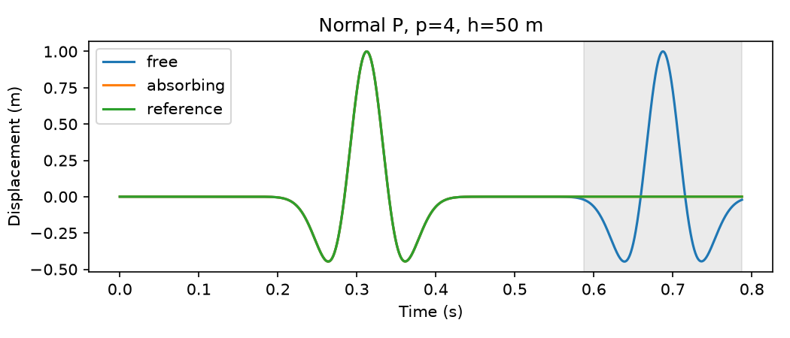
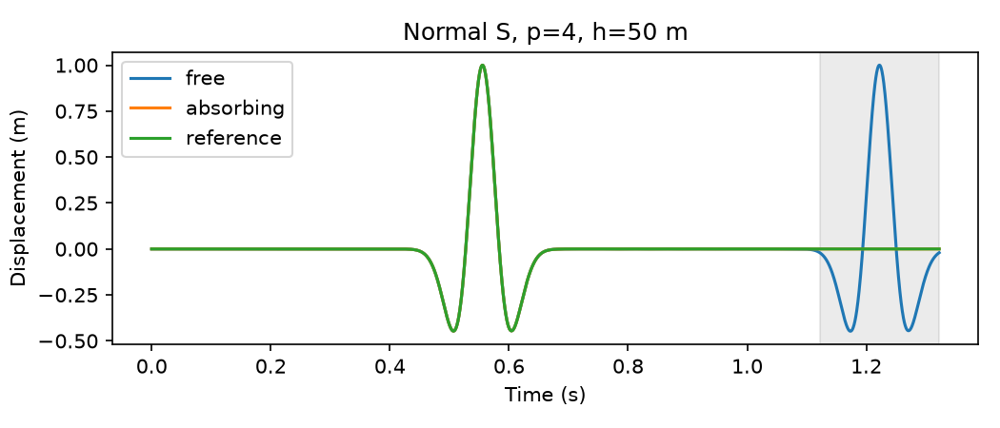

# Local elastic absorbing boundaries for GLL SEM

This milestone supports the existing free/absorbing side API for homogeneous
and element-aligned horizontal isotropic SEM layers, p=1–6, on structured
affine rectangular quadrilaterals. The baseline is `edaec57`. This is a **local
first-order elastic impedance condition**, not a PML. It is exact for normally
incident continuum plane P/SV waves in a locally homogeneous isotropic medium;
oblique and finite-beam reflections generally remain.

## Shared physics, signs and material traces

Coordinates are (x,z), positive-up z. On an outward-normal exterior facet,

```
sigma(u)*n + B*v = 0
B = Zs*I + (Zp-Zs)*n*n^T
Zp = rho*Vp = sqrt(rho*(lambda+2*mu))
Zs = rho*Vs = sqrt(rho*mu)
C(w,v) = integral_Gamma w·B*v ds
```

This is exactly the production triangular absorber's impedance tensor, sign and
weak form, assembled by the same `assemble_boundary_damping` helper. It includes
both normal P and tangential SV impedance. For vertical sides B=diag(Zp,Zs);
for horizontal sides B=diag(Zs,Zp). Squared normals make the outward-normal sign
consistent on opposite sides; the traction itself still uses the outward n.

Homogeneous coefficients keep the original scalar expression. For layers,
synchronized DG0 rho/lambda/mu provide the unique adjacent-cell trace on each
exterior facet. There is no nodal/global impedance averaging and no internal
interface integral. At an interface node on a side, each incident element edge
contributes its own material-weighted quadrature value.

The existing triangular path keeps its original facet locator, default
quadrature, consistent matrix and row-sum damping. No triangular numerical
expression or time integration code changed. The previous tests establish
normal reflection refinement, imperfect oblique absorption, physical free-surface
preservation, local-material assignment, corners, reciprocity/startup behavior,
energy/work balance and MPI. They do not establish arbitrary-angle exactness.

## GLL edge quadrature and exterior geometry

SEM uses GLL edge quadrature of degree 2p−1. The trace of a tensor-product Qp GLL
basis is the 1D GLL nodal basis. At edge quadrature nodes, nodal collocation and
the diagonal axis-aligned B make the assembled C diagonal to roundoff. The
production damping array is **C's extracted diagonal**, never row sums. A
collective guard rejects a non-diagonal C or negative/nonfinite damping.

Corners receive the sum of the two adjacent segment integrals. They have no
special correction. For an element corner with horizontal length hx and vertical
length hz, the combined contribution is
`rho/[p(p+1)] * (hz*[Vp,Vs] + hx*[Vs,Vp])` when both incident sides absorb.
Mixed free sides simply contribute no boundary integral.

The tensor-product coordinate mesh needs deliberate facet selection. On a 2×3
mesh, DOLFINx 0.11's `locate_entities_boundary` missed the first right exterior
edge, producing a 0.447 relative p=1 boundary-matrix error. SEM therefore enumerates
owned exterior facets, maps them with `entities_to_geometry`, and requires all
physical facet vertices on the selected side. The side tolerance remains the
existing `1e-8 * element_length`. This fixes the new SEM boundary path without
changing coordinates, topology, the triangular locator or the boundary physics.
The complete-matrix and explicit corner tests catch the original failure.

**Volume M/K still use FFCx sum factorization.** Facet forms use ordinary FFCx
form evaluation (default sum_factorization=False); no facet-factorization claim
is made. Both K and C remain assembled PETSc matrices. This is not matrix-free.
All-free configurations return C=None and exact zero damping before facet search.

## Independent operator reference

The NumPy-only reference obtains GLL nodes/weights from Legendre polynomials,
evaluates 1D Lagrange edge functions and scatters their impedance-weighted edge
integrals. It uses physical vertices to classify each cell's material, without
production facet tags, coefficient values or UFL/FFCx. Tests cover p=1,2,4,6,
one side, two adjacent sides, all sides, and free-top/absorbing-other-sides,
for both homogeneous and three-layer A/B/A models: 32 complete matrices.

The domain is [-1,2]×[-1.5,1.5], with 2×3 elements. A=(rho,Vp,Vs)=(2.3,3.2,1.8),
B=(4.1,4.6,2.5); interfaces are z=±0.5. The bottom-right corner is also checked
explicitly against the sum above. Damping is nonnegative and symmetric.

| p | maximum C reference error | maximum relative off-diagonal |
|---|---:|---:|
| 1 | 2.3519e-16 | 0.0000e+00 |
| 2 | 5.3918e-16 | 0.0000e+00 |
| 4 | 8.4820e-15 | 0.0000e+00 |
| 6 | 1.3988e-13 | 0.0000e+00 |

## Recurrence, stability and discrete work

The unchanged production recurrence is

```
(D + dt*C_d/2) u[n+1] = 2D*u[n] - (D-dt*C_d/2)u[n-1] + dt²(f[n]-K*u[n])
v[n] = (u[n+1]-u[n-1])/(2dt)
E[n+1/2] = 0.5 v[n+1/2]^T D v[n+1/2] + 0.5 u[n+1]^T K u[n]
```

Taking the scalar product of the recurrence with centered v[n] and using the
symmetry of K gives exactly

```
E[n+1/2]-E[n-1/2] = dt*v[n]^T*f[n] - dt*v[n]^T*C_d*v[n].
```

For source-free runs, summed boundary dissipation accounts for the energy loss;
this test does not merely check monotonic decay. Below the undamped critical dt,
the half-step energy is nonnegative. With nonnegative damping the identity is a
stability estimate even when K and C do not commute. The centered treatment adds
no separate damping CFL. The production conservative assembled row bound and
`dtcrit=2/sqrt(lambda_max(D^(-1/2)KD^(-1/2)))` remain unchanged. Dense NumPy
spectra independently check the small-system critical timestep.

The dissipation audit starts random finite initial data and runs at 0.8
of the conservative bound for at least 20 s at every p. A fixed 600-step probe
gave different physical durations across degrees and retained more high-frequency
energy at p=6; the formal test uses fixed physical duration without relaxing
energy-balance tolerances. It also checks that switching free→absorbing leaves
M, K, diagonal mass and the conservative bound bitwise unchanged. Existing
free-boundary half-step conservation tests remain in the full SEM gate.

| p | dt (s) | undamped dtcrit (s) | max step balance / E0 | cumulative balance / E0 | final E/E0 |
|---|---:|---:|---:|---:|---:|
| 1 | 0.1606503 | 0.2325579 | 2.171e-16 | 7.238e-16 | 0.000183 |
| 2 | 0.06174083 | 0.09101069 | 1.586e-16 | 1.171e-15 | 0.004357 |
| 4 | 0.01986336 | 0.03244556 | 3.460e-16 | 3.908e-16 | 0.029300 |
| 6 | 0.009617126 | 0.01602862 | 3.537e-16 | 2.198e-16 | 0.075099 |

## Normal P/SV and large-domain controls

The normal packet is the reused plane Ricker displacement
`q=(1-2s²)exp(-s²)`, `s=(x-800)/w`, `w=c/(pi*8 Hz)`, with velocity `-c*dq/dx`.
P displaces in x and SV in z; both travel toward +x. Material properties are
rho=2400 kg/m³, Vp=3200 m/s, Vs=1800 m/s. The same vector elastic kernel is used
for both modes, with no scalar substitution and no constraints.

The control box is x∈[0,2400], z∈[−12000,12000] m, and the large box extends
x to 4800 m. Only the right side changes from free to absorbing; all other
sides are free. The plane packet is uniform in z. There are 24 transverse
elements (1000 m each), and longitudinal h=100 or 50 m with p=4. This broad
strip isolates the central observation from lateral free-boundary disturbances.
A preliminary ±6000 m strip showed an SV residual plateau near 6.9e-4 on further
longitudinal refinement; moving those side boundaries farther away removed that
limitation. This geometry is a normal-plane-wave control, not a general beam
resolution recommendation.

The receiver is (1800,0) m. Incident/reflected arrival centers are 1000/c and
2200/c. Separate ±0.1 s windows isolate the two packets. Duration is the reflected
center plus 0.1 s, rounded up to the common time grid. dt=0.001*(h/100) s is
identical for free/absorbing/large-box runs and below the accepted bound.
The large-box right return is well outside the window. The side boundaries are
more than two maximum-speed travel distances from the central analysis region.

Residual reflection is the peak vector displacement of `u_abs-u_large` in the
reflection window, divided by the incident receiver amplitude. Free reflection
uses `u_free-u_large`. Suppression is 20log10(A_abs/A_free). Waveform error is
the corresponding reflected-window L2 ratio. Interior error samples 55 physical
points with x=1200…2200, z=−150…150 m at final time, normalized by the free-box
error on the same points. The JSON also records dimensional RMS errors. These
are displacement diagnostics, not elastic energy fractions.

| mode | h (m) | free reflection | absorber residual / incident | abs/free (dB) | waveform ratio | sampled-field ratio |
|---|---:|---:|---:|---:|---:|---:|
| P | 100 | 1.0001035 | 4.3496e-04 | -67.232 | 4.3966e-04 | 6.0822e-04 |
| P | 50 | 0.9999959 | 5.9586e-05 | -84.497 | 5.8517e-05 | 6.0982e-05 |
| S | 100 | 0.9824713 | 8.3097e-03 | -41.455 | 8.3774e-03 | 1.2069e-02 |
| S | 50 | 0.9999469 | 1.7813e-04 | -74.985 | 1.9149e-04 | 4.0465e-04 |




The shaded interval isolates reflection. Incoming amplitudes match between
free/absorbing controls, and free returns are approximately unit amplitude.
The refined P and SV acceptance limits are 8e-5 and 2.5e-4, respectively, selected
above measured residuals with the requirement of at least fourfold improvement
from the coarse grid. The field limits are 8e-5 and 5e-4. No existing tolerance
was changed and no continuum nonzero normal-reflection coefficient was invented.

## Oblique and heterogeneous behavior

The oblique controls use the existing gradient/rotated-gradient localized
potential packet (8 Hz, transverse Gaussian width 400 m), at 25°, with p=4 and
h=100 m. The hit point is (2400,0), initial center 1600 m back along the incident
direction, and receiver 600 m along the specular reflected direction. z spans
±4800 m. The three boxes otherwise follow the same free/absorbing/large-box
comparison. Finite angular bandwidth, mode conversion and differing ray paths
make these receiver proxies, not single-angle signed plane-wave coefficients.
No branch-resolved P/SV purity claim is made for reflected oblique packets.

| incident mode | abs/free reflection proxy | suppression (dB) | reflected waveform ratio | sampled-field ratio |
|---|---:|---:|---:|---:|
| P | 0.013621 | -37.316 | 0.012382 | 0.011747 |
| S | 0.445074 | -7.031 | 0.404380 | 0.211138 |

SV reflection at 25° is substantial: this is a limitation of the local condition,
not a claim of PML-like behavior. The large-box control separates boundary-induced
returns from propagation already present on the same discrete grid.

Localized normal P in material A and SV in material B additionally hit a vertical
side crossing z=0. Their centers/hit depths are −2400 and +2400 m, far from the
internal interface. Each layered absorbing trace is compared with a homogeneous
box having the same local material, initial packet, geometry, dt and receiver.
The strong-contrast operator tests and MPI case separately use three A/B/A layers
and a free top with absorbing sides/bottom.

Layered versus local-homogeneous absorbing waveform relative L2 differences are
6.9372e-15 for P in A and
1.7982e-08 for SV in B. The new 1e-7 gate
allows the measured tiny remote-interface/finite-packet influence in SV; it
does not assert exact equality between different global material models.
The complete boundary matrices independently constrain local impedance assignment.

## Triangular and public-API controls

The triangular comparison uses the same normal packet, material, receiver,
domain and large-box truth, with h_x=20 m and dt=0.0005 s. Transverse geometry is
the same broad strip; this is a physics comparison, not an equal-work benchmark.
The triangular result is not the reference truth.

| triangular mode | free reflection | absorber residual / incident | suppression (dB) | reflected arrival error (s) | sampled-field ratio |
|---|---:|---:|---:|---:|---:|
| P | 0.974707 | 0.008695 | -40.992 | 0.006500 | 0.009148 |
| S | 0.887400 | 0.024327 | -31.241 | 0.083778 | 0.030872 |

The coarse P1 SV waveform shows appreciable dispersion (arrival error about
0.084 s); its paired large-domain control prevents counting that entire
dispersion error as absorber reflection. No accuracy-per-work conclusion is
drawn from this comparison.

The tracked [example](../../examples/2d/gll_sem_absorbing.py) runs a physical
point line force of amplitude 1e8 N/m, direction (1,1), 5 Hz Ricker with shift
0.3 s, at (17.3,−1000.7) m. The small domain is [−1200,1200]×[−2400,0] m,
p=4/h=100 m, dt=0.001 s, duration 1.8 s. The top is free; sides/bottom absorb.
Receivers (700.4,−1000.7) and (400.4,−1050.2) are off-node. A larger free box
[−3600,3600]×[−4800,0] preserves the physical free surface as the control truth.
The point force excites both modes. Far-receiver direct P/SV window centers are
0.51346875/0.6795 s, based on distance and speeds plus the wavelet shift; these
are analysis windows, not a claim that finite-bandwidth 2D waveform peaks occur
exactly at those times. Both displacement components have resolved signals.

The late (t>1.05 s) waveform-error ratio, absorbing/free relative to the
large-domain control, is **0.116451**. The early-window relative
error is 3.232213e-04. Direct P/SV component peaks are
1.982574e-04 / 4.852955e-04 m.
The returned displacement and velocity shapes are both (1801,2,2).

## MPI and archived compatibility

The p=4 8×8 MPI model uses A/B/A layers with interfaces z=±0.25 on [−1,1]²,
free top and absorbing other sides. Both materials are present on multiple
ranks; every rank owns absorbing facets. Facet centers/material traces, nodal
mass, K*x, C*x, damping diagonal, timestep, public histories and final initialized
u/v are sorted by physical coordinates. Corner contributions and coefficient
ghost synchronization are included.

| maximum relative difference from serial | 2 ranks | 4 ranks |
|---|---:|---:|
| cells | 0.0000e+00 | 0.0000e+00 |
| facets | 0.0000e+00 | 0.0000e+00 |
| u | 1.9645e-14 | 1.8826e-14 |
| v | 1.4019e-14 | 1.1822e-14 |
| safe_dt | 0.0000e+00 | 0.0000e+00 |
| dtcrit | 3.7129e-16 | 0.0000e+00 |
| mass | 0.0000e+00 | 1.3387e-17 |
| action | 3.5570e-14 | 3.3735e-14 |
| final_u | 2.0244e-14 | 1.9244e-14 |
| final_v | 9.4460e-13 | 7.6749e-13 |
| damping | 0.0000e+00 | 0.0000e+00 |
| damping_action | 3.4261e-17 | 3.4261e-17 |

Archived `edaec57` comparisons are bitwise identical for both homogeneous and
layered free SEM: M, K, diagonal mass, damping, stable dt, stiffness action,
source vector, displacement/velocity histories and final initialized u/v.
Archived triangular homogeneous and heterogeneous operator/material/history
snapshots are also bitwise identical. The no-absorber path performs no facet
search. The only changed old rejection tests replace the now-supported absorbing
setting with unsupported PML input; no numerical threshold was weakened.

## Reproduction and scope

```bash
OMP_NUM_THREADS=1 OPENBLAS_NUM_THREADS=1 SEISFEM_SEM_REPORT_DIR=/tmp/sem-abc \
  python -m pytest -ra tests/sem2d
python -m tests.sem2d.absorbing_report /tmp/sem-abc \
  docs/validation/2d_gll_sem_absorbing_measurements.json
```

The collection also requires the archived compatibility record. Run
`tests/sem2d/absorbing_compatibility.py` directly with baseline/current src on
PYTHONPATH for homogeneous and layered snapshots, and the existing triangular
audits, then compare each npz array bitwise. The
[measurement JSON](2d_gll_sem_absorbing_measurements.json) records the numerical
results and packet meshes, materials, widths, directions, dt, duration and sides.

All validation gates passed; the final audit was completed on 2026-09-28.

| gate | result | pytest elapsed time |
|---|---:|---:|
| focused operators/configuration/factorization/MPI | 65 passed | 3.11 s |
| absorber packets and public source workflow | 9 passed | 193.85 s |
| complete SEM suite | 129 passed | 876.51 s |
| seven existing 2D suites | 283 passed | 2035.07 s |
| complete repository regression | 551 passed | 2640.13 s |

These counts overlap: the full regression includes the focused suites. No tests
failed or were skipped. Ruff, format checks, all-file pre-commit hooks and staged
and unstaged whitespace checks passed. The exact commands and compatibility
audit are recorded in the [check log](2d_gll_sem_absorbing_checks.txt).

Supported: independently selected free or absorbing left/right/lower/upper sides
for the current homogeneous/element-aligned horizontal isotropic SEM scope.
Unsupported: fixed/componentwise constraints, within-element discontinuities,
non-horizontal material interfaces, VTI, PML, curved/non-affine quadrilaterals,
attenuation, poroelasticity, matrix-free execution and 3D. The global PETSc
stiffness remains assembled. No general reflectionless-boundary or performance
superiority claim is made.
