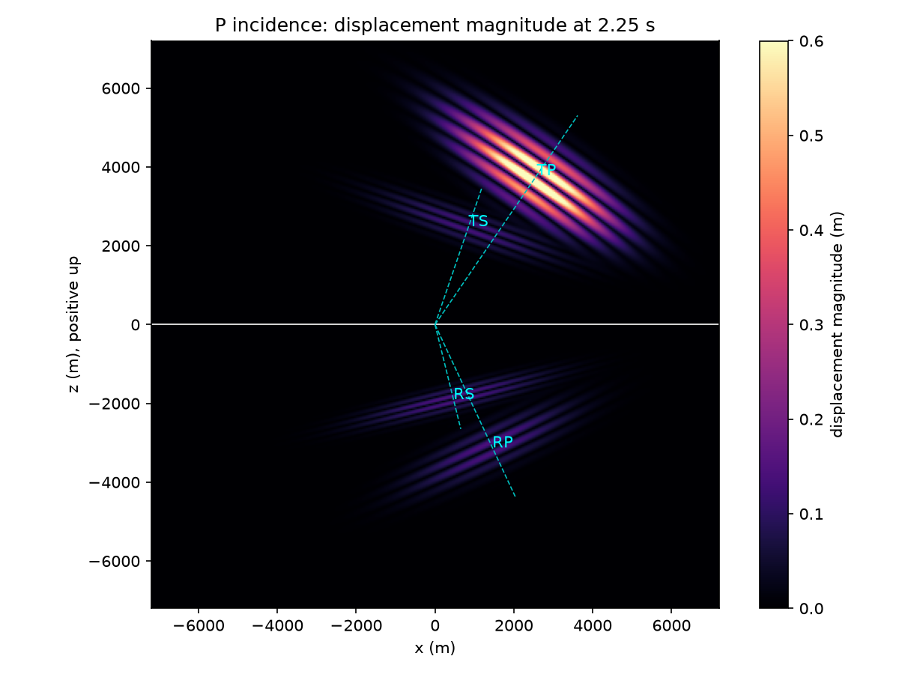
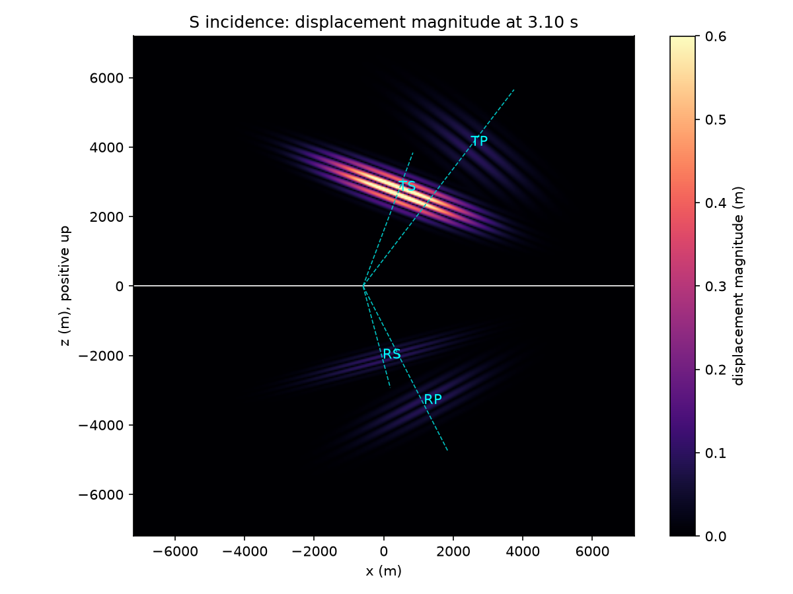
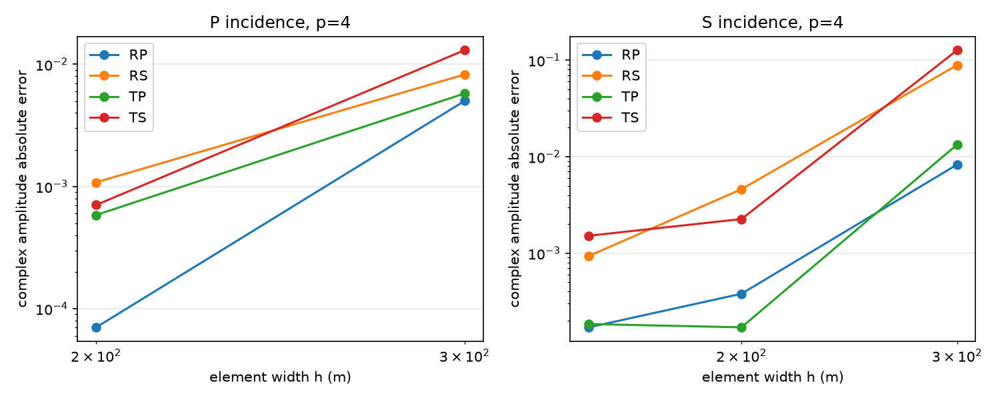
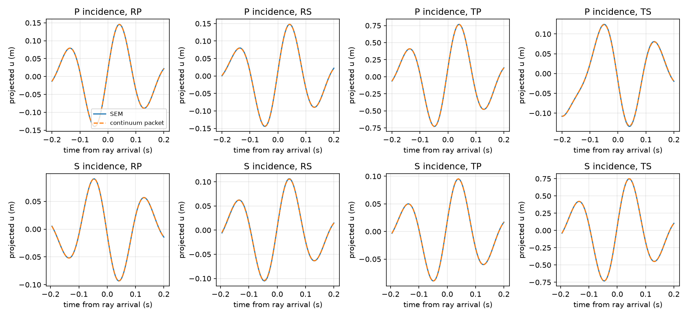

# Oblique isotropic interface scattering with GLL SEM

This validation concerns a single horizontal, planar, element-aligned welded
interface in 2D isotropic plane strain. It exercises the production assembled
GLL operators, DG0 material assignment and normal explicit start/step path from
`18be5ea031c42ecd6f138dfb536ef0bd771f5c04`. No production source files were changed.
The numerical results and completed gates are
recorded below and in the companion measurement JSON.

At p=4, the finest primary P/SV cases have maximum absolute complex coefficient
errors of 1.08e-3 / 1.52e-3 and inferred flux-closure residuals of
2.63e-4 / 1.11e-4. Both material directions are tested. The evidence supports
below-critical mode conversion within this stated geometry and resolution;
finite-beam angle shifts and the time-discretization phase floor remain visible.

## Independent reference and conventions

Coordinates are (x,z), positive-up z. Incidence is upward from the lower medium;
theta is measured from +z toward +x. Reverse-material experiments exchange the
lower/upper material properties while keeping upward incidence. They are not
experiments with downward incidence in the original geometry.

For each mode use `u=A d exp[i omega (p x+q z-t)]`, where
`p=sin(theta_inc)/c_inc`, `n=c(p,q)`, and
`q=sign(nz)*sqrt(1/c²-p²)`. Reflected modes have negative nz, transmitted modes
positive nz. The below-critical guard rejects any `abs(c*p)>=1`.
The signed displacement polarizations are `dP=n` and `dSV=(nz,-nx)`.
Tabulated branch angles use `atan2(nx,abs(nz))`: reflected angles are measured
from −z toward +x, and their propagation vectors retain negative nz.
In particular the reflected polarization's excited component changes sign at
normal incidence; the amplitude is not the reflected Cartesian component.

The NumPy-only reference constructs the full displacement gradient
`G=d outer (p,q)`, strain `e=(G+G.T)/2`, and stripped stress
`S=lambda trace(e) I+2 mu e`, with `mu=rho Vs²` and
`lambda=rho(Vp²-2Vs²)`. Traction on the **common +z normal** is `tau=S[:,1]`;
the common factor i*omega*A is stripped. The four columns of the welded system
are `[d;tau]` for RP/RS and `-[d;tau]` for TP/TS. The right-hand side is the
negative incident column. Traction rows are divided by the incident P impedance
before solving. Displacement and traction continuity are independently checked
after the solve. No raw dimensional condition number is interpreted.

Since velocity is `-i omega A d`, upward mechanical flux is
`-Re[(i omega A tau) dot (-i omega A d)*]/2`
`=omega² |A|² Re(tau dot d*)/2`. The reference computes this from traction;
unit-amplitude flux independently agrees with `rho c nz/2` after removing
omega². Reflected flux fractions reverse their downward sign. Each outgoing
fraction is `abs(F_branch)/F_inc * |A_branch|²`. The analytical sum closes to
roundoff. Reported numerical flux fractions are **inferred central-plane-wave
fluxes from complex displacement transfer coefficients**, not raw squared
waveforms or a separately measured total packet energy flux.

The new full-stress implementation is tested against the existing independent
isotropic oblique reference for signed coefficients and flux, both directions,
positive/negative p, and normal incidence. Normal P/S conversion vanishes and
the remaining coefficients reduce to the corresponding P/shear impedance
formula. Neither reference imports FEM/SEM assembly or an external Zoeppritz
package.

## Packet and diagnostic design

The incident potential is
`Phi=exp[-s²/(2 sigma_s²)-r²/(2 sigma_r²)] cos(k0*s)/k0`, with
`uP=grad(Phi)`, `uSV=(Phi_z,-Phi_x)` and `v=-c_inc partial_s u`.
The carrier is 5 Hz, `sigma_s=0.6*c_inc/f0`, and the accepted transverse width
is 1500 m. The initial center is (−1400,−3000) m. Translation-consistent velocity
is prescribed through the normal production start path, not a new source API.
A finite beam has an angular distribution and a small backward-frequency
component; it is not literally one plane wave.
The initial Gaussian also has a nonzero tail above the interface: its squared
displacement fraction there is 1.37e-9 for P and 8.24e-23 for SV, sampled on the
40 m grid over the full physical box. This is a localization diagnostic, not
an energy fraction or a claim of exactly compact initial support.

Independent continuum synthesis resolves the forward incident Fourier density
into the four scattered spectra using the reference coefficients at each
horizontal slowness. Frequency and kx are conserved. The spatial Fourier
Jacobian is `J=abs(d kz_out/d kz_in)=c_inc*nz_inc/(c_out*abs(nz_out))` at fixed
kx. Differentiating the conserved dispersion relation
`c_inc*sqrt(kx²+kz_inc²)=c_out*sqrt(kx²+kz_out²)` gives
`c_inc*nz_inc*d(kz_inc)=c_out*nz_out*d(kz_out)`, including the reflected sign.
Changing integration variables uses its absolute Jacobian. The output density
is `Z(p)*U_inc/J`; a finite-difference Jacobian test
checks the normalization independently. Nonpropagating spectral tails are
excluded and quantified, without an evanescent validation claim.

Two amplitude diagnostics are retained:

1. The primary diagnostic fits two complex scalar coefficients to the two
   independently synthesized vector packet templates in each half-space.
   This is a spatial least-squares projection using uniform area weights on
   a 40 m physical sampling grid; it is not a Gaussian ray template. The two
   vector modes are fitted jointly to account explicitly for overlap. No angle,
   delay, center, width or frequency is fitted. Multiplying the fitted scale by
   the reference central coefficient gives the measured signed coefficient.
2. A separate Fourier integral at the conserved central kx and each branch kz
   projects onto its polarization, divides by the initial incident transform,
   applies J, and removes the known propagation phase. This estimator does not
   use the outgoing coefficient as a template normalization.

Both retain real and imaginary parts. Continuum-packet audits and injected
negative branch scalings check the signed recovery before SEM results are
accepted. The finite-bandwidth template method is justified by this audit and
by refinement; it is not the exploratory translated-Gaussian estimator.

Angle measurement is separate: smooth half-space windows suppress the interface
cut, positive-temporal-frequency displacement is formed from u and v using
the modal frequency `c*|k|`, projected onto P/SV polarizations, and the largest
connected spectral lobe is selected using only outgoing hemisphere, mode and a
broad 2.5–7.5 Hz band. The estimator receives no predicted Snell angle. Its
power-weighted phase-normal centroid and spread are compared both with Snell's
central angle and the independently synthesized finite beam. These differ
slightly because coefficient/frequency weighting shifts finite-beam centroids.

Cross-polarization leakage is the perpendicular/parallel ratio of the central
complex displacement transform after separating the other modal frequency.
At fixed wavevector, `U=Ub+Uo` and `i V=omega_b Ub+omega_o Uo`, hence
`Ub=(i V-omega_o U)/(omega_b-omega_o)`. This operation does not project away
the perpendicular component: an independent test injects a 1% wrong
polarization at the target frequency and recovers it unchanged in the presence
of a much stronger other mode. The raw unseparated ratio is also retained in
JSON. For reverse SV incidence the raw transmitted-P ratio is about 3.8% even
in the exact continuum packet, because the SV spectrum overlaps at a different
frequency; it would be incorrect to label that overlap numerical impurity.
Finite spatial windows and negative-frequency tails set a residual floor, so
this remains a packet diagnostic rather than an exact modal decomposition.
Receiver diagnostics use one physical position
on each outgoing central ray, reached 0.4 s before the field measurement. Their
vector histories are compared with independent continuum spectral histories;
envelope-peak arrival errors are measured against that finite-packet control.
Ray arrival predictions are recorded separately. The receiver peak is not the
primary coefficient estimator.

The report retains both a conservative full-vector template residual and a
mode-separated Fourier waveform error over the same broad outgoing band used
for angle measurement. The latter removes the other mode's numerical waveform
error instead of attributing it to a weak converted branch. Neither diagnostic
fits a time shift. The complex overlap of the two spatial template columns is
recorded to quantify whether their simultaneous projection is identifiable.

## Exterior boundaries and conservation

All outer boundaries are free. No absorber is used as scattering truth.
The accepted domain is [−14400,14400]² m, with z=0 exactly on an element row.
The common analysis window is [−7200,7200]² m; P/S field times are 2.25/3.1 s
for A-to-B incidence. Reverse cases scale time by the lower incident speed to
preserve incident travel distance. The packet, domain and measurement times
remain fixed through spatial refinement.
The 14400 m half-width is the smallest common 600 m multiple that leaves a
0.1 s margin for both primary cases under the conservative five-sigma bound
below. It accommodates all selected mesh widths and the MPI control exactly.

For the initial five-sigma ellipse, the coordinate bounding radii are
`5*sqrt((sigma_s*n)²+(sigma_r*t)²)`. Let its coordinate bounds be L/U, the
analysis half-width be a and the exterior half-width b. A path that first
reflects from the negative/positive coordinate boundary has length at least
`2b+L-a` / `2b-U-a`. Dividing each by the largest material P speed gives a
conservative earliest return to any point in the analysis window. The report
records all four times and their margin beyond the measurement end.

A Gaussian is not compactly supported: this is a bound for its energetic core,
not an assertion of mathematically zero tails. Its envelope at five sigma is
3.73e-6. A larger-domain control independently bounds the actual influence of
those tails and exterior reflections on the numerical diagnostics.

The interface has no force, penalty, or special traction term; continuity is
provided by the conforming weak form. With no forcing or damping, the production
half-step invariant
`E=0.5*v_half.T*M*v_half+0.5*u_next.T*K*u_current`
is monitored throughout propagation. Displacement squared is never called
energy. The assembled spectral stability machinery and conservative accepted
timestep remain unchanged.

## Scope limits

The claim is restricted to propagating below-critical P/SV scattering at one
horizontal, planar, element-aligned isotropic interface on structured affine
quadrilaterals. It does not establish critical/evanescent waves, head/interface
waves, non-horizontal interfaces, VTI/TTI, PML, curved geometry, attenuation,
poroelasticity, matrix-free application, or 3D. No exponential convergence claim
is made across discontinuous material properties. The local absorber remains
imperfect for oblique incidence and is not exercised as the reference here.
The new quantitative propagation study uses p=4. The previous p=1–6 operator
and absorber validations remain intact; this report does not separately
establish oblique coefficient accuracy for every supported polynomial degree.

## Reproduction and validation gates

The final full repository run passed **588 tests**, including **166 SEM tests**
and **37 new scattering tests**. The seven existing 2D suites also passed
separately (**283 tests**). The initial development sweep and its corrected
reverse-SV refinement are recorded transparently in the execution audit.

The new tests are under `tests/sem2d/scattering/`. The suite always runs the
production solver; it never substitutes saved measurements for an experiment.
Use one BLAS/OpenMP thread per rank:

```bash
OMP_NUM_THREADS=1 OPENBLAS_NUM_THREADS=1 \
  SEISFEM_SEM_REPORT_DIR=/tmp/sem-scatter \
  python -m pytest -ra tests/sem2d/scattering
```

The report also includes a separately executed triangular P control:

```bash
OMP_NUM_THREADS=1 OPENBLAS_NUM_THREADS=1 mpiexec -n 4 \
  python -m tests.sem2d.scattering.experiment \
  /tmp/sem-scatter/scattering-triangle-P.json --mode P --h 25 --degree 0
```

`degree=0` is only this test runner's selector for the existing public `tri_p1`
configuration. It does not extend the SEM degree API. Compatibility snapshots
use the existing `tests.sem2d.absorbing_compatibility`,
`tests.sem2d.compatibility` and `tests.heterogeneous2d.mpi_worker` executables
against archived/current source trees. Their results and the retained
reverse-SV coarse pilot accompany the freshly computed pytest measurements.

```bash
python -m tests.sem2d.scattering.compatibility /tmp/sem-scatter
OMP_NUM_THREADS=1 OPENBLAS_NUM_THREADS=1 \
  python -m tests.sem2d.scattering.experiment \
  /tmp/sem-scatter/scattering-reverse-S-coarse.json --mode S --reverse --h 200
```

Generate the compact JSON, figures and numerical tables with:

```bash
python -m tests.sem2d.scattering.report /tmp/sem-scatter \
  docs/validation/2d_gll_sem_oblique_interface_measurements.json
```

See [the execution audit](2d_gll_sem_oblique_interface_checks.txt) for exact
commands and gate results. The [measurement JSON](2d_gll_sem_oblique_interface_measurements.json)
includes mesh/configuration, packet, timestep, histories (decimated for size),
branch predictions and diagnostics. Large field arrays remain outside git.
## Quantitative results

Tables are generated from the companion JSON; S means SV.

### Materials, resolution and reference audit

| Material | rho (kg/m³) | Vp / Vs (m/s) | lambda / mu (GPa) |
| --- | --- | --- | --- |
| A | 2200 | 3000 / 1700 | 7.084 / 6.358 |
| B | 2500 | 4000 / 2300 | 13.550 / 13.225 |

P incidence is 25°; SV incidence is 15°. All four branches are propagating. For A→B the nearest central critical limit is SV incidence at asin(1700/4000) =25.15°. No critical-angle result is accepted. The same angles are used for B→A.

| Independent reference audit | Maximum absolute residual |
| --- | --- |
| continuity | 2.910e-16 |
| flux_closure | 4.441e-16 |
| old_amplitude | 2.776e-16 |
| old_flux | 4.441e-16 |
| horizontal_symmetry | 0.000e+00 |
| normal_impedance | 1.110e-16 |

The audit spans P/S, both material directions, and 0°, 15°, 25°, −15°. The old independent reference uses the same deterministic polarization convention; no fitted sign transformations are applied. At normal incidence the converted coefficients are exactly zero. Normal P has R=0.2048192771, T=0.7951807229; normal S has R=0.2118018967, T=0.7881981033.

| Case | h / p (m) | vector DOFs | dt (s) | dt/safe_dt | carrier SV points/λ | time (s) |
| --- | --- | --- | --- | --- | --- | --- |
| P-300 | 300 / 4 | 296450 | 0.0005 | 0.0720 | 4.53 | 2.25 |
| P-200 | 200 / 4 | 665858 | 0.0005 | 0.1080 | 6.80 | 2.25 |
| S-300 | 300 / 4 | 296450 | 0.0005 | 0.0720 | 4.53 | 3.1 |
| S-200 | 200 / 4 | 665858 | 0.0005 | 0.1080 | 6.80 | 3.1 |
| S-150 | 150 / 4 | 1182722 | 0.0005 | 0.1440 | 9.07 | 3.1 |
| reverse-P | 200 / 4 | 665858 | 0.0005 | 0.1080 | 6.80 | 1.6875 |
| reverse-S | 150 / 4 | 1182722 | 0.000499957 | 0.1439 | 9.07 | 2.2913 |

Carrier minimum wavelengths are 600 m (P) and 340 m (SV). Average nodal spacing is h/p, not the smallest nonuniform GLL spacing. The broad analysis band extends to 7.5 Hz, so its shortest SV wavelength is 226.7 m. The 300 m SV grid is deliberately retained as under-resolution evidence. Time steps are about 0.5 ms; central-difference carrier phase accumulation is about 0.00073 rad (P) and 0.0010 rad (SV), which matters at the finest spatial resolution. No fitted convergence order or exclusively spatial error claim is made at that floor.

### Finite-beam and estimator audit

| Incidence | sigma_s / sigma_r (m) | angular RMS (°) | excluded spectral energy | max complex recovery error | max independent Fourier error | inferred closure error |
| --- | --- | --- | --- | --- | --- | --- |
| P | 360 / 1500 | 2.383639 | 6.815e-09 | 9.673e-09 | 2.575e-04 | 1.819e-10 |
| S | 204 / 1500 | 1.349683 | 2.110e-07 | 7.525e-09 | 6.218e-05 | 3.592e-09 |

| Incidence | integrated-flux vector error: sigma_r=750 m | sigma_r=1500 m |
| --- | --- | --- |
| P | 1.328e-03 | 3.159e-04 |
| S | 2.138e-03 | 5.251e-04 |

These are continuum spectrum-integrated flux fractions compared with the central plane-wave partition. Doubling the width reduces this finite-beam bias by more than threefold. The accepted packet uses the broader width. Both the direct continuum estimator audit and an independently injected negative branch scaling test preserve coefficient signs. The separate central Fourier estimator has a larger finite-window floor than the spatial template estimator; both are retained in JSON, and neither is silently substituted for the other.

### Signed and complex coefficients

**P-200: A→B, h=200 m, p=4.**

| Branch | analytic A | Re(Ahat) | Im(Ahat) | abs(Ahat) | phase residual (rad) | complex error | analytic flux | inferred flux |
| --- | --- | --- | --- | --- | --- | --- | --- | --- |
| RP | 0.15429789 | 0.15434597 | -5.131e-05 | 0.15434598 | -3.324e-04 | 7.032e-05 | 0.02380784 | 0.02382268 |
| RS | 0.16018046 | 0.15973378 | 9.845e-04 | 0.15973681 | 6.163e-03 | 1.081e-03 | 0.01557563 | 0.01548947 |
| TP | 0.82612979 | 0.82596925 | -5.615e-04 | 0.82596944 | -6.798e-04 | 5.840e-04 | 0.94258649 | 0.94222060 |
| TS | -0.14080438 | -0.14148250 | 1.966e-04 | 0.14148264 | -1.390e-03 | 7.061e-04 | 0.01803004 | 0.01820416 |

Outgoing inferred flux sum: 0.9997369200; closure residual: 2.631e-04. Maximum relative complex error: 0.675%.

**S-150: A→B, h=150 m, p=4.**

| Branch | analytic A | Re(Ahat) | Im(Ahat) | abs(Ahat) | phase residual (rad) | complex error | analytic flux | inferred flux |
| --- | --- | --- | --- | --- | --- | --- | --- | --- |
| RP | -0.10156690 | -0.10150422 | 1.583e-04 | 0.10150434 | -1.559e-03 | 1.702e-04 | 0.01676594 | 0.01674530 |
| RS | 0.11467077 | 0.11533863 | 6.508e-04 | 0.11534047 | 5.643e-03 | 9.325e-04 | 0.01314939 | 0.01330342 |
| TP | 0.10207646 | 0.10207214 | -1.844e-04 | 0.10207230 | -1.807e-03 | 1.844e-04 | 0.02287747 | 0.02287561 |
| TS | 0.79707455 | 0.79697109 | -1.512e-03 | 0.79697252 | -1.898e-03 | 1.516e-03 | 0.94720720 | 0.94696471 |

Outgoing inferred flux sum: 0.9998890401; closure residual: 1.110e-04. Maximum relative complex error: 0.813%.

**reverse-P: B→A, h=200 m, p=4.**

| Branch | analytic A | Re(Ahat) | Im(Ahat) | abs(Ahat) | phase residual (rad) | complex error | analytic flux | inferred flux |
| --- | --- | --- | --- | --- | --- | --- | --- | --- |
| RP | -0.14989154 | -0.14961586 | 6.308e-05 | 0.14961587 | -4.216e-04 | 2.828e-04 | 0.02246747 | 0.02238491 |
| RS | -0.17161857 | -0.17308806 | 6.387e-04 | 0.17308924 | -3.690e-03 | 1.602e-03 | 0.01812607 | 0.01843806 |
| TP | 1.17245397 | 1.17209603 | -5.329e-04 | 1.17209615 | -4.547e-04 | 6.420e-04 | 0.94944240 | 0.94886297 |
| TS | 0.15666813 | 0.15547899 | 1.362e-03 | 0.15548495 | 8.761e-03 | 1.808e-03 | 0.00996406 | 0.00981413 |

Outgoing inferred flux sum: 0.9995000612; closure residual: 4.999e-04. Maximum relative complex error: 1.154%.

**reverse-S: B→A, h=150 m, p=4.**

| Branch | analytic A | Re(Ahat) | Im(Ahat) | abs(Ahat) | phase residual (rad) | complex error | analytic flux | inferred flux |
| --- | --- | --- | --- | --- | --- | --- | --- | --- |
| RP | 0.11089594 | 0.11093437 | -2.395e-04 | 0.11093463 | -2.159e-03 | 2.426e-04 | 0.01977223 | 0.01978603 |
| RS | -0.13263606 | -0.13362270 | 1.138e-03 | 0.13362754 | -8.514e-03 | 1.506e-03 | 0.01759232 | 0.01785632 |
| TP | -0.09985068 | -0.09995929 | 1.978e-04 | 0.09995949 | -1.979e-03 | 2.257e-04 | 0.01115217 | 0.01117649 |
| TS | 1.19982661 | 1.19921836 | -1.904e-04 | 1.19921837 | -1.587e-04 | 6.373e-04 | 0.95148328 | 0.95051884 |

Outgoing inferred flux sum: 0.9993376732; closure residual: 6.623e-04. Maximum relative complex error: 1.135%.

### Refinement, phase angles and polarization

| Case | max signed-real error | max complex error | max flux-fraction error | closure error | max modal waveform error | max polarization leakage | max centroid discretization error (°) |
| --- | --- | --- | --- | --- | --- | --- | --- |
| P-300 | 8.233e-03 | 1.304e-02 | 7.191e-03 | 1.065e-02 | 2.539e-01 | 3.981e-03 | 1.461e-02 |
| P-200 | 6.781e-04 | 1.081e-03 | 3.659e-04 | 2.631e-04 | 1.884e-02 | 1.343e-03 | 2.356e-03 |
| S-300 | 1.203e-01 | 1.269e-01 | 2.619e-01 | 2.703e-01 | 1.640e+00 | 6.377e-02 | 1.856e-01 |
| S-200 | 4.365e-03 | 4.603e-03 | 3.988e-03 | 2.923e-03 | 4.958e-02 | 1.358e-03 | 1.280e-02 |
| S-150 | 6.679e-04 | 1.516e-03 | 2.425e-04 | 1.110e-04 | 3.861e-02 | 3.715e-04 | 3.125e-03 |

The vector norms of signed, complex, flux and modal waveform errors decrease at each refinement; 300→200 m reduces them by more than 6.7 times in both primary cases. Individual very small coefficient errors need not decrease monotonically once temporal and estimator errors compete. No global exponential convergence claim is made across the material jump. The reverse-SV 200 m pilot failed the unchanged acceptance limits: its closure error was 1.3373e-2. Refining to 150 m reduced it to 6.6233e-4; the coarse record remains in the JSON.

| Case/branch | Snell (°) | finite-continuum centroid (°) | SEM centroid (°) | SEM angular RMS (°) | SEM−continuum absolute (°) | polarization leakage | arrival error (ms) |
| --- | --- | --- | --- | --- | --- | --- | --- |
| P-200/RP | 25.00000 | 24.76576 | 24.76604 | 2.4207 | 2.766e-04 | 5.160e-05 | 0.0742 |
| P-200/RS | 13.85607 | 13.97875 | 13.97800 | 1.2479 | 7.463e-04 | 1.710e-04 | 0.5392 |
| P-200/TP | 34.29757 | 34.31683 | 34.31699 | 3.5307 | 1.525e-04 | 4.226e-05 | 0.0269 |
| P-200/TS | 18.90545 | 19.27268 | 19.27033 | 1.7530 | 2.356e-03 | 1.343e-03 | 0.3384 |
| S-150/RP | 27.17691 | 27.38384 | 27.38402 | 2.5625 | 1.766e-04 | 3.715e-04 | 0.1931 |
| S-150/RS | 15.00000 | 14.54596 | 14.54909 | 1.3146 | 3.125e-03 | 1.017e-04 | 0.0465 |
| S-150/TP | 37.51622 | 38.51838 | 38.51809 | 3.9754 | 2.912e-04 | 3.376e-04 | 0.2175 |
| S-150/TS | 20.49753 | 20.49555 | 20.49553 | 1.9080 | 2.445e-05 | 6.202e-05 | 0.1079 |
| reverse-P/RP | 25.00000 | 24.45145 | 24.45034 | 3.1897 | 1.108e-03 | 6.933e-04 | 0.1772 |
| reverse-P/RS | 14.06400 | 14.36386 | 14.36165 | 1.6745 | 2.212e-03 | 1.992e-04 | 0.1910 |
| reverse-P/TP | 18.47940 | 18.46158 | 18.46149 | 2.3052 | 9.321e-05 | 3.186e-05 | 0.0399 |
| reverse-P/TS | 10.34721 | 10.68843 | 10.68794 | 1.2386 | 4.963e-04 | 2.421e-04 | 1.9630 |
| reverse-S/RP | 26.75139 | 27.36931 | 27.36919 | 3.4106 | 1.205e-04 | 1.093e-03 | 0.4190 |
| reverse-S/RS | 15.00000 | 14.45324 | 14.45569 | 1.7939 | 2.451e-03 | 1.942e-04 | 0.5074 |
| reverse-S/TP | 19.73012 | 20.41586 | 20.41505 | 2.4539 | 8.084e-04 | 2.467e-03 | 0.0435 |
| reverse-S/TS | 11.02872 | 11.02578 | 11.02612 | 1.3452 | 3.387e-04 | 4.548e-05 | 0.0081 |

The finite-beam centroid can differ from the central Snell angle by about 1° for a weak converted branch. Its nonzero angular spread is reported rather than misinterpreted as numerical angle error. Arrival errors use the finite-packet envelope at independently placed ray receivers, with no fitted lag. All accepted principal-case envelope peaks lie inside the measurement windows.









### Boundary isolation, controls and energy

| Case | left return (s) | bottom (s) | right (s) | top (s) | minimum margin (s) | half-step energy relative range |
| --- | --- | --- | --- | --- | --- | --- |
| P-200 | 3.340064 | 3.758796 | 4.040064 | 5.258796 | 1.090064 | 6.530e-15 |
| S-150 | 3.237687 | 4.105784 | 3.937687 | 5.605784 | 0.137687 | 9.428e-15 |
| reverse-P | 3.331858 | 3.688952 | 4.031858 | 5.188952 | 1.644358 | 4.015e-15 |
| reverse-S | 3.236689 | 4.061312 | 3.936689 | 5.561312 | 0.945385 | 5.753e-15 |

Moving all free walls from ±14400 to ±15600 m in the SV h=300 m control changes receiver histories by 1.002e-13 relative and any reported amplitude/imaginary/flux/angle scalar by at most 1.776e-13. This checks actual boundary influence in addition to the conservative travel-time bound.

The oblique identical-material layered/homogeneous control is bitwise equal in both final fields, displacement/velocity histories and safe timestep. Its scattered reflected field (layered minus homogeneous) is exactly zero. This does not call the homogeneous packet's tiny incoming/tail content reflected energy.

### Triangular comparison

| Method | h (m) | DOFs | max complex coefficient error | max flux error | closure error | global projection residual |
| --- | --- | --- | --- | --- | --- | --- |
| tri_p1 | 25.0 | 2658818 | 2.331e-01 | 3.512e-02 | 3.596e-02 | 1.549e-01 |
| quad_gll p=4 | 200 | 665858 | 1.081e-03 | 3.659e-04 | 2.631e-04 | 5.661e-03 |

Both use the identical P packet, material pair, physical box, time step, analysis window and independent continuum diagnostics. The triangle run is illustrative, not an equal-work comparison or a new triangular convergence study. Its larger phase error is reported without treating it as truth. The existing isotropic oblique suite supplies the previous triangular refinement evidence.

### MPI and compatibility

| Diagnostic | 1 vs 2 ranks | 1 vs 4 ranks |
| --- | --- | --- |
| mass | 8.185e-18 | 1.637e-17 |
| action | 7.737e-16 | 4.718e-16 |
| safe_dt | 0.000e+00 | 0.000e+00 |
| material_audit | 0.000e+00 | 0.000e+00 |
| damping | 0.000e+00 | 0.000e+00 |
| trace | 1.522e-13 | 1.200e-13 |
| final_u | 3.245e-13 | 2.814e-13 |
| final_v | 2.109e-13 | 2.256e-13 |

| Absolute derived difference | 1 vs 2 ranks | 1 vs 4 ranks |
| --- | --- | --- |
| real amplitude | 3.483e-15 | 2.279e-15 |
| imaginary amplitude | 3.022e-15 | 5.357e-15 |
| flux | 1.110e-15 | 4.052e-15 |
| angle (°) | 2.132e-13 | 3.055e-13 |

The MPI partition-equivalence control uses p=4, h=600 m, with physical-coordinate ordering. Its coarse mesh is not an amplitude-accuracy case. Both materials are present on multiple ranks and the interface crosses partitions. All damping is zero. The stricter shared gate is 3e-11; measured field discrepancies are at floating-point accumulation scale.

| Ranks | Owned cell counts (lower, upper), by rank; ghosts excluded |
| --- | --- |
| 2 | (55, 1098); (1097, 54) |
| 4 | (550, 22); (572, 0); (0, 587); (30, 543) |

| Archived 18be5ea compatibility | arrays compared | bitwise equal | max absolute difference |
| --- | --- | --- | --- |
| sem-free | 11 | True | 0.0e+00 |
| sem-layered | 11 | True | 0.0e+00 |
| tri-free | 8 | True | 0.0e+00 |
| tri-layered | 10 | True | 0.0e+00 |

Production source files, sum-factorized volume forms, GLL quadrature, diagonal mass, timestep recurrence and public API are unchanged. This milestone adds validation utilities under tests only. No absorber is relied upon for any accepted interface measurement.
